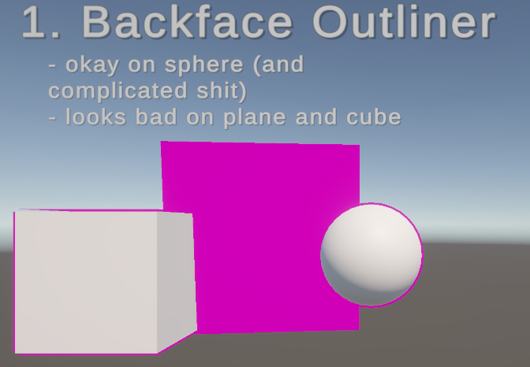

# Unity Outline

Quick example project to explore various ways of doing outlines.

So far we have:

1. BackfaceOutlineShader : apparently a common technique. it only renders the backfacing tris and uses the normals to perterb the position outwards by some factor, then renders a solid color for all fragments. doesn't work on a plane particularly well. looks a little funny with a cube.

## Backface Outliner

